# MR Booking

[English](README.md)

افزونه حرفه‌ای مدیریت نوبت و رزرو برای وردپرس — تقویم شمسی/میلادی، خدمات، پرسنل، ساعات کاری، تعطیلات، پیامک، ایمیل، پیش‌پرداخت (زرین‌پال / کیف پول)، ورود OTP مشتری و حسابداری.

**نسخه:** 2.5.2  
**سازنده:** [Reza Ansarirad](https://rezaansarirad.ir)  
**نیازمندی‌ها:** WordPress 5.8+ · PHP 8.0+

جزئیات کامل نسخه‌ها: [CHANGELOG.md](CHANGELOG.md)

---

## تصاویر

### پنل مدیریت

| | |
| --- | --- |
| **داشبورد** — آمار، رزروهای امروز، فعالیت اخیر | **نوبت‌ها** — فیلتر، وضعیت‌ها، تأیید/رد |
|  |  |
| **رزرو تلفنی** — ثبت دستی از پنل | **مشتریان** — جستجو، تولد، کیف پول، خروجی CSV |
|  |  |
| **خدمات** — کارت‌ها با عملیات سریع | **خدمت جدید** — مدت و وضعیت قیمت |
|  | 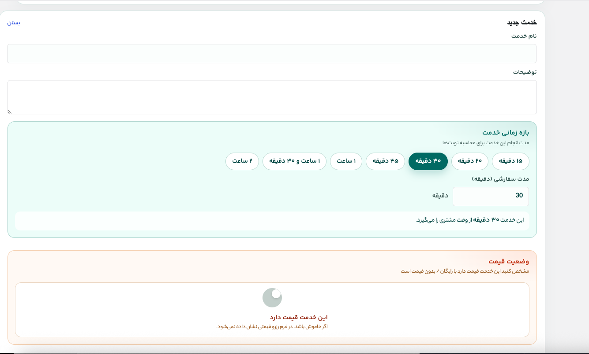 |
| **پرسنل** — لیست با خدمات هر نفر | **ویرایش پرسنل** — پروفایل و انتخاب خدمات |
| 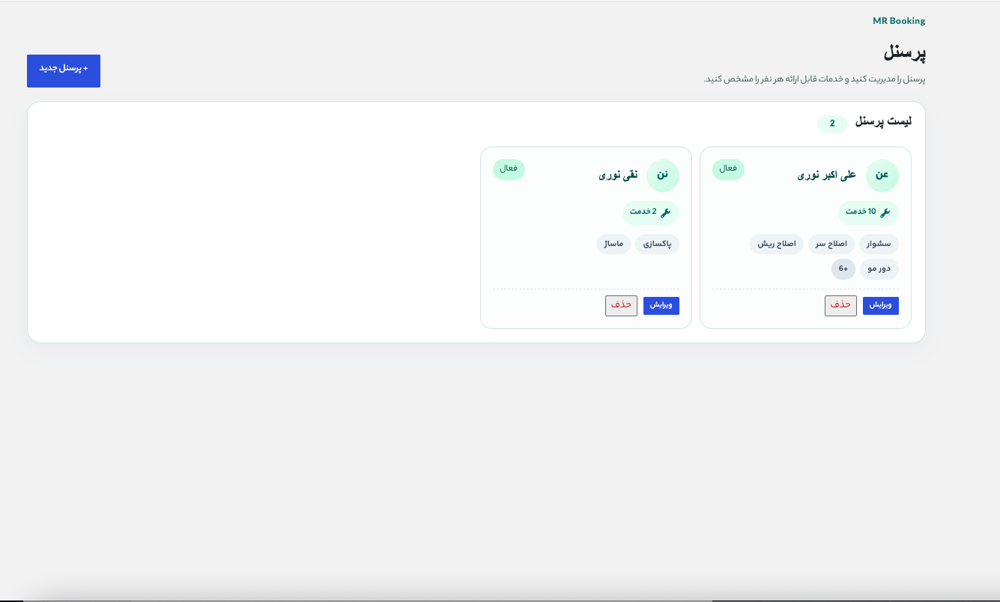 | 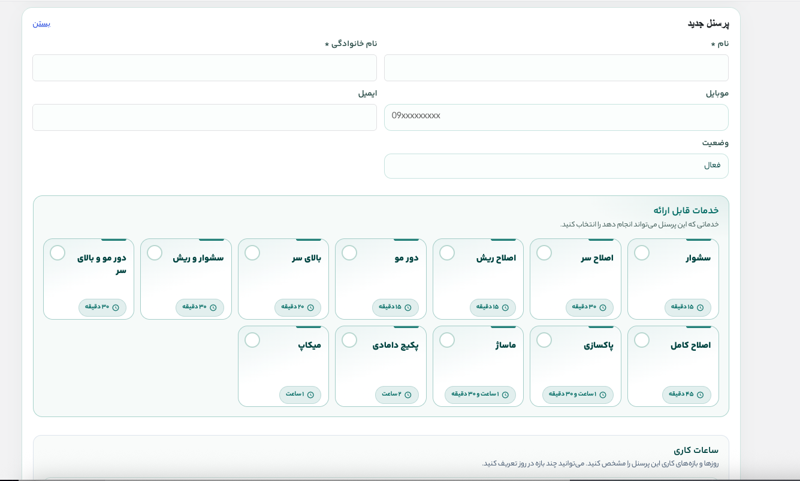 |
| **ساعات کاری** — بازه‌های هر روز | **ساعات مسدود** — ناهار و استراحت تکراری |
|  | 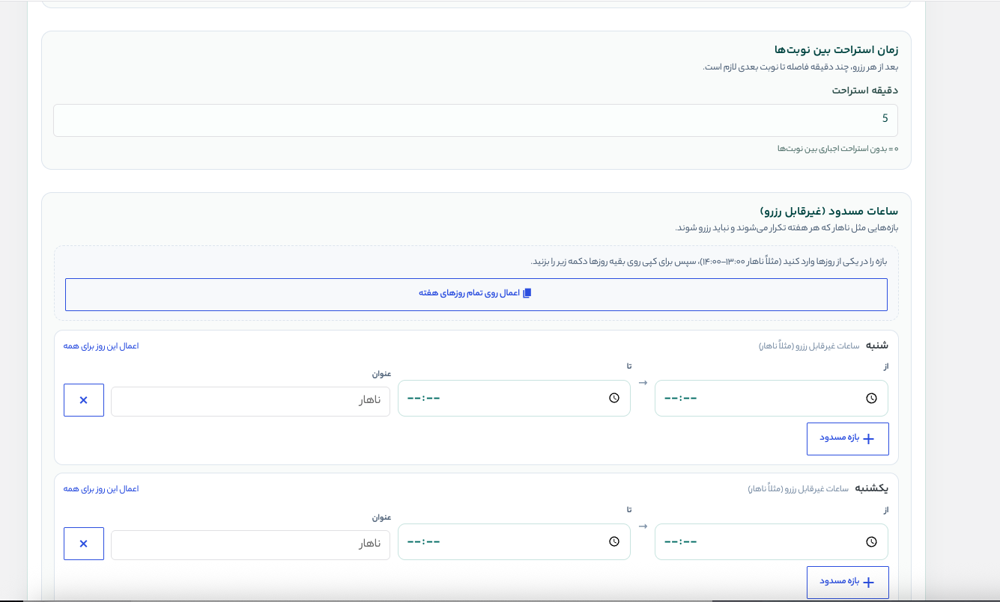 |
| **تعطیلات و تاریخ‌های خاص** | **گزارش‌ها** — بازه تاریخ و خدمات محبوب |
| 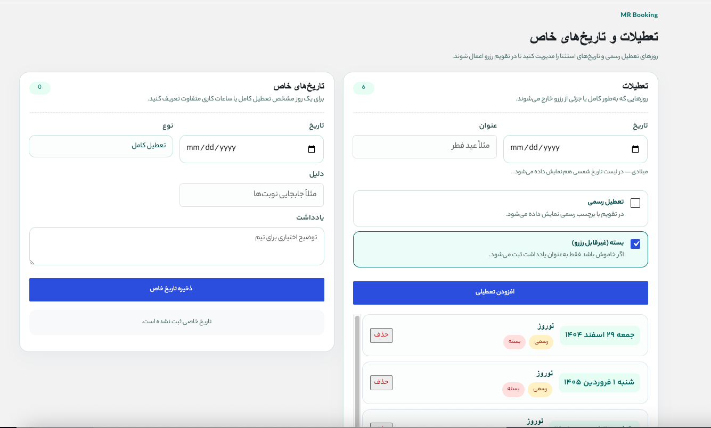 | 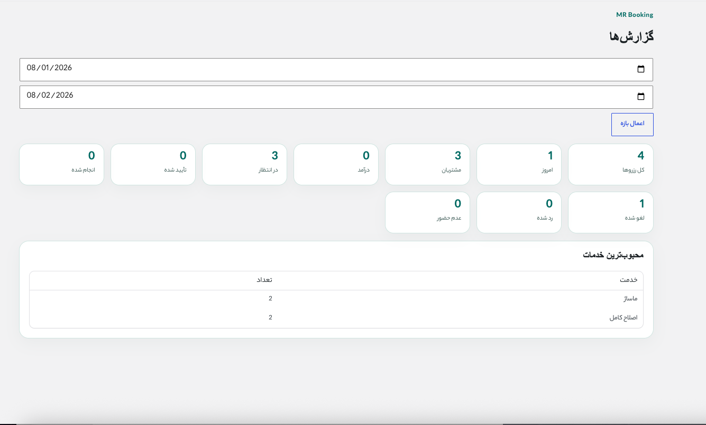 |
| **قالب‌های اعلان** — متغیرها و تأیید مشتری | **قالب ایمیل / پیامک** — ویرایش هر رویداد |
|  | 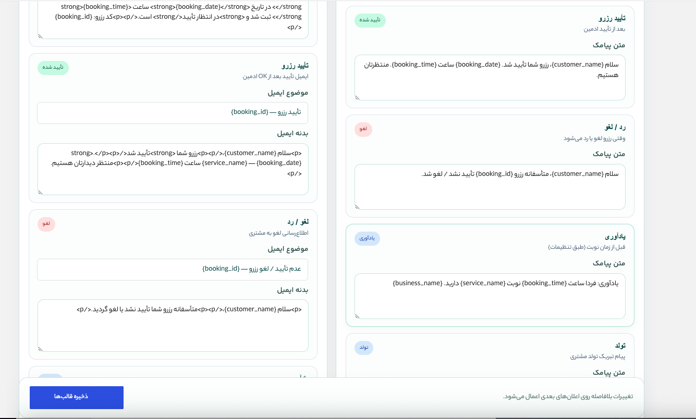 |
| **منوی وردپرس** (badge در انتظار) | **اعلان زنده** رزرو جدید در پنل |
| 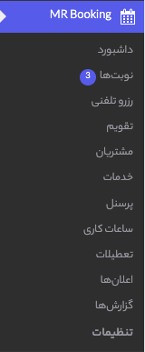 |  |

### تنظیمات

| | |
| --- | --- |
| **عمومی** — کسب‌وکار، نوع ساعات، گزینه‌های فرم | **تب‌های تنظیمات** — منوی کناری |
|  | 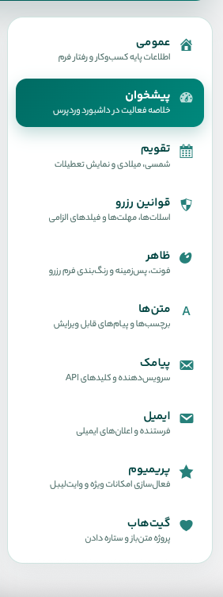 |
| **تقویم** — شمسی / میلادی / هر دو | **قوانین رزرو** — اسلات‌ها و الزامات |
|  |  |
| **ظاهر** — قالب تیره / روشن | **پالت رنگ** — دکمه‌ها و لودینگ |
| 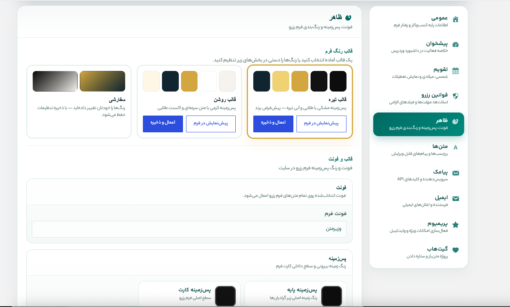 | 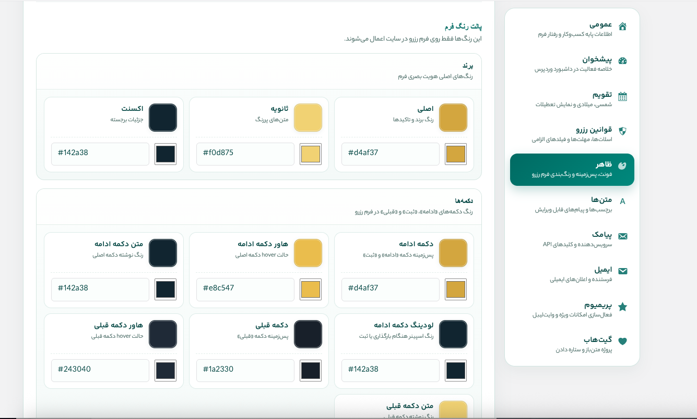 |
| **رنگ کارت خدمات** | **رنگ روزهای تقویم** |
|  |  |
| **متن‌ها** — مراحل و دکمه‌ها | **Placeholder** — راهنمای فیلدها |
| 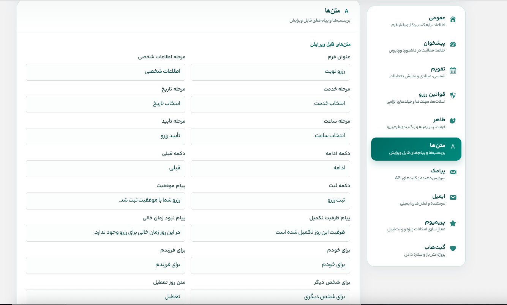 |  |
| **ویجت پیشخوان** | **پیامک** — سرویس‌دهنده و API |
|  |  |
| **ایمیل** — فرستنده و گیرندگان | **پریمیوم** — مخفی‌کردن برند در فرم عمومی |
|  |  |
| **گیت‌هاب** — لینک پروژه متن‌باز | |
|  | |

### فرم رزرو (فرانت)

| | |
| --- | --- |
| **مرحله ۱** — اطلاعات شخصی و «رزرو برای» | **مرحله ۲** — پرسنل و انتخاب خدمت |
|  | 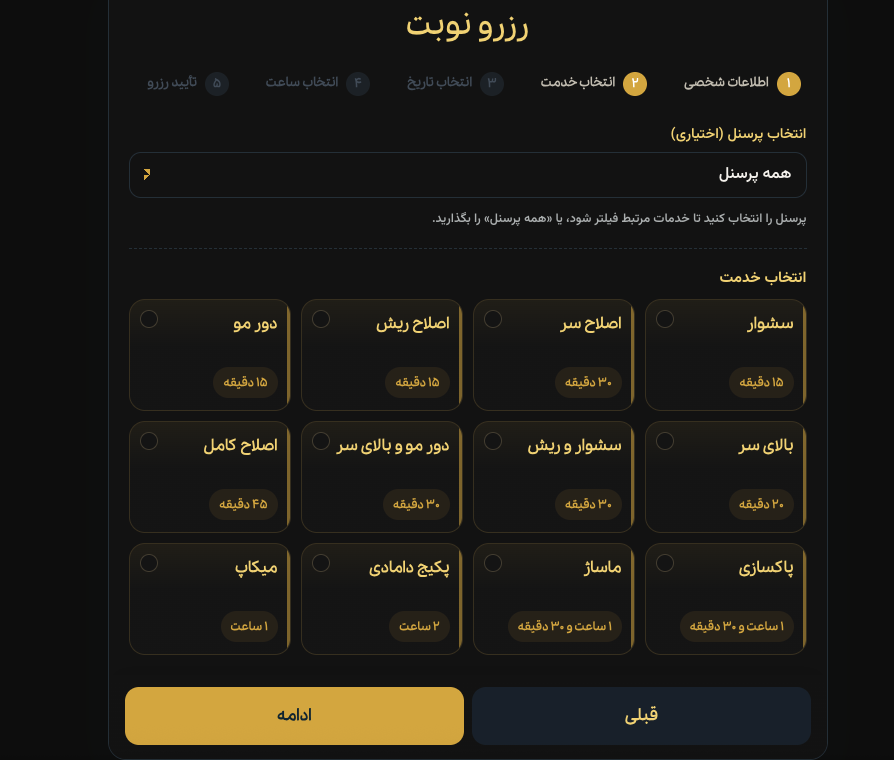 |
| **مرحله ۳** — تقویم شمسی | **مرحله ۴** — انتخاب ساعت |
|  | 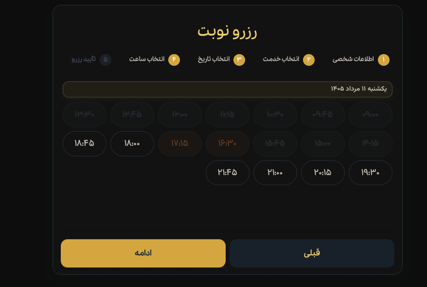 |
| **موفقیت** — رسید تأیید رزرو | **انتخاب تاریخ تولد** — چرخ iOS-style با فلش در دسکتاپ |
|  | 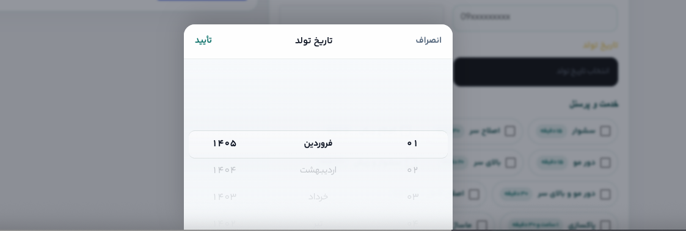 |

---

## نصب

1. پوشه `mr-booking` را در `wp-content/plugins/` کپی کنید.
2. از پیشخوان وردپرس افزونه **MR Booking** را فعال کنید.
3. جداول دیتابیس و تنظیمات پیش‌فرض به‌صورت خودکار ساخته می‌شوند.
4. **ویزارد راه‌اندازی اولیه** باز می‌شود و این موارد را می‌گیرد:
   - نام کسب‌وکار
   - نوع تقویم (شمسی / میلادی / هر دو)
   - ساعات کاری و روزهای تعطیل
   - پرسنل
   - خدمات فعال
   - قوانین رزرو و رنگ‌های ظاهر

اگر ویزارد را رد کنید، بعداً از منوی **رزروها** → راه‌اندازی اولیه یا تنظیمات قابل پیکربندی است.

نام منوی افزونه بر اساس زبان سایت: **رزروها** (فارسی) یا **Booking Form** (انگلیسی).

---

## نمایش فرم رزرو برای بازدیدکنندگان

### شورت‌کد

یک **برگه** بسازید و این شورت‌کد را بگذارید:

```
[mr_booking]
```

ویژگی‌های اختیاری:

```
[mr_booking service="12"]
[mr_booking staff="5"]
[mr_booking theme="default"]
[mr_booking embed="account"]
```

`embed="account"` فرم را بدون هدر و چیپ ورود داخل پنل مشتری نشان می‌دهد.

### پنل مشتری (OTP)

برگه‌ای با این شورت‌کد بسازید:

```
[mr_booking_account]
```

سپس آن برگه را در **تنظیمات → حساب کاربری** انتخاب کنید. مشتری با OTP پیامکی وارد می‌شود، نوبت‌ها را می‌بیند، تا N دقیقه قبل لغو می‌کند، کیف پول را مدیریت می‌کند و (اختیاری) از داخل پنل رزرو می‌کند.

حالت ورود فرم: **خاموش / اختیاری / الزامی**. گزینه **«رزرو نوبت داخل پنل مشتری»** ویزارد را داخل داشبورد حساب جاسازی می‌کند.

### المنتور (Elementor)

1. صفحه را با Elementor ویرایش کنید.
2. دسته **رزروها** / **Booking Form** را باز کنید.
3. ویجت را بکشید داخل صفحه.
4. تب Content: پیش‌انتخاب خدمت/پرسنل.
5. تب Style: رنگ، فونت، دکمه‌ها، کارت خدمات، فیلدها.

رنگ سراسری: **تنظیمات → ظاهر**.

---

## پیش‌پرداخت، پرداخت و قوانین

همه قابلیت‌های پیش‌پرداخت با **تنظیمات → پرداخت → «نمایش و دریافت پیش‌پرداخت»** کنترل می‌شوند. با خاموش بودن، فرم مثل قبل رفتار می‌کند.

- **پیش‌پرداخت هر خدمت** — در ویرایشگر خدمت و ویرایش سریع؛ پیش‌فرض **۵۰٪ قیمت** (گرد به ۱٬۰۰۰) با فیلتر `mr_booking_default_deposit_ratio`.
- **مرحله پرداخت (۶)** — وقتی پیش‌پرداخت فعال و مبلغ > ۰ باشد: انعام اختیاری، **پرداخت با کیف پول** و/یا **زرین‌پال**.
- **زرین‌پال** (v4 REST، ریال) — مرچنت، سندباکس، کالبک مشترک برای پیش‌پرداخت و افزایش موجودی.
- **قوانین و شرایط** — لینک داخل جمله رضایت، مودال متن کامل، چک‌باکس الزامی.

با لغو/رد/حذف رزرو پرداخت‌شده، پیش‌پرداخت + انعام یک‌بار به کیف پول برمی‌گردد (`mr_booking_refund_deposit`).

---

## کیف پول مشتری

- جدول `mr_wallet_transactions` (موجودی = مجموع تراکنش‌ها).
- پنل مشتری → **کیف پول**: موجودی، تاریخچه، فرم افزایش موجودی (چیپ‌های مبلغ + جداکننده هزارگان؛ حداقل مبلغ در تنظیمات پرداخت).
- ادمین → **مشتریان**: ستون موجودی + تغییر موجودی از لیست؛ پنل کامل در جزئیات مشتری.
- موجودی در نوبت‌ها، داشبورد، حسابداری و جستجوی رزرو تلفنی/حضوری هم دیده می‌شود.
- لیست نوبت‌ها ستون **پرداخت** دارد (وضعیت، روش، مبلغ).

---

## مراجعه حضوری و رزرو تلفنی

### رزرو تلفنی

**رزروها → رزرو تلفنی** — جستجوی مشتری، خدمت/پرسنل/اسلات، وضعیت. همان موتور اسلات فرم عمومی.

### مراجعه حضوری

**رزروها → مراجعه حضوری** (`mr_booking_walkin`) — برای مشتری حاضر در محل. `source = walkin`، شروع = الان. اسلات آنلاین را **مسدود نمی‌کند**. مبلغ هر خدمت قابل ویرایش؛ بدون پیامک پیش‌فرض (`mr_booking_notify_walkin`).

---

## حسابداری

**رزروها → حسابداری** (`mr_booking_accounting`):

- بازه‌های آماده (هماهنگ با تقویم شمسی ادمین)، بازه سفارشی، گروه‌بندی روز/ماه
- فیلتر خدمت، پرسنل، منبع (آنلاین / تلفنی / حضوری)، وضعیت
- کارت KPI، تفکیک‌ها، دفتر، خروجی CSV
- درآمد از مبلغ ذخیره‌شده روی هر نوبت در زمان ثبت

---

## نوبت‌ها و مدیریت اسلات

در **نوبت‌ها**:

- **تأیید** / **رد** / **لغو** / **حذف** (آزاد شدن اسلات در صورت نیاز)
- **ویرایش پروفایل مشتری** از جزئیات
- نمایش **موجودی کیف پول** و **روش پرداخت**
- ماندگاری **فیلتر و مرتب‌سازی** بعد از رفرش

تعداد **در انتظار** روی منو به‌صورت badge است. پیش‌فرض مرتب‌سازی: **زمان ثبت** (جدیدترین اول).

---

## اعلان‌ها

### اعلان به مشتری

| رویداد | زمان |
| ------ | ---- |
| **ثبت درخواست** | بلافاصله بعد از ثبت رزرو |
| **تأیید رزرو** | بعد از تأیید ادمین |
| **لغو / رد** | هنگام رد، لغو یا حذف رزرو آینده |
| **یادآوری** | قبل از زمان نوبت |
| **تولد** | پیامک تبریک تولد (در صورت پیکربندی) |

قالب‌ها در **اعلان‌ها**. همه ارسال‌ها در `notification_logs` ثبت می‌شوند.

### اعلان به ادمین

با هر رزرو جدید، ایمیل (و در صورت فعال بودن پیامک) به گیرندگان **تنظیمات → ایمیل / پیامک**.

### ارسال OTP (کاوه‌نگار)

برای تحویل مطمئن کد ورود، در **تنظیمات → پیامک → «نام الگوی کد ورود»** نام قالب Verify/Lookup کاوه‌نگار با `%token%` را بگذارید. بدون نام الگو از `sms/send` ساده استفاده می‌شود. تلاش‌های ناموفق لاگ می‌شوند (کد ماسک‌شده).

---

## نقش‌های کاربری و دسترسی

| نقش | دسترسی |
| --- | ------ |
| **منشی رزرو** (`mr_booking_receptionist`) | نوبت‌ها، رزرو تلفنی، مراجعه حضوری، مشتریان، تقویم |
| **مدیر رزرو** (`mr_booking_manager`) | همه بخش‌ها شامل **تنظیمات** و حسابداری |

کاربران فقط‌رزرو فقط منوی افزونه را می‌بینند. قابلیت‌های `mr_booking_*` با User Role Editor قابل تنظیم‌اند. راهنما: **تنظیمات → دسترسی**.

---

## اعلان زنده در پنل

در صفحات MR Booking: بررسی خودکار رزرو جدید، toast + صدای اختیاری، لینک به نوبت‌ها. فاصله در **تنظیمات → پیشخوان** (۰ = خاموش).

---

## ظاهر و قالب رنگ

**تنظیمات → ظاهر** — قالب تیره/روشن، برند، دکمه‌ها، کارت خدمات، تقویم، اسپینر لودینگ.

**تنظیمات → حساب کاربری → «رنگ‌بندی پنل مشتری»**:

- **سبز — همرنگ پنل مدیریت** (پیش‌فرض)
- **همرنگ فرم رزرو**

داشبورد حساب (و ویزارد جاسازی‌شده) از متغیرهای `--mrb-*` پیروی می‌کند.

---

## ویجت پیشخوان

از **تنظیمات → پیشخوان** ویجت خلاصه فعالیت وردپرس را فعال کنید. داشبورد MR Booking رزروهای امروز و ثبت‌های اخیر را نشان می‌دهد.

---

## منوی مدیریت

- داشبورد
- نوبت‌ها (badge، ستون پرداخت، موجودی در سلول مشتری)
- رزرو تلفنی
- مراجعه حضوری
- تقویم (روز / هفته / ماه)
- مشتریان (ستون کیف پول، تغییر موجودی، CSV، تولد)
- خدمات (ویرایش سریع قیمت/پیش‌پرداخت، جداکننده هزارگان)
- پرسنل
- ساعات کاری
- تعطیلات و تاریخ‌های خاص
- اعلان‌ها
- گزارش‌ها
- حسابداری
- تنظیمات (عمومی، تقویم، قوانین، ظاهر، متن‌ها، **پرداخت**، **حساب کاربری**، پیامک، ایمیل، دسترسی)

---

## تقویم

فقط شمسی / فقط میلادی / هر دو. تاریخ‌ها در دیتابیس میلادی ذخیره می‌شوند.

---

## پیامک

سرویس‌دهندگان:

- **کاوه‌نگار** — تست اتصال، اعتبار در تنظیمات و admin bar، قالب OTP Verify
- ملی‌پیامک
- SMS.ir

```php
add_filter( 'mr_booking_sms_providers', function( $providers ) {
    // $providers['myprovider'] = new My_Provider();
    return $providers;
});
```

---

## REST API

پایه: `/wp-json/mr-booking/v1/`

| Endpoint | Method | دسترسی | توضیح |
| -------- | ------ | ------ | ----- |
| `/services` | GET | عمومی | لیست خدمات |
| `/staff` | GET | عمومی | لیست پرسنل |
| `/availability/month` | GET | عمومی | موجودی ماه |
| `/availability/slots` | GET | عمومی | اسلات‌های یک روز |
| `/book` | POST | عمومی (nonce) | ثبت رزرو |
| `/settings/public` | GET | عمومی | تنظیمات عمومی فرانت |
| `/payment/callback` | GET | عمومی | بازگشت زرین‌پال |
| `/auth/request-otp` | POST | عمومی* | درخواست OTP |
| `/auth/verify-otp` | POST | عمومی* | تأیید OTP |
| `/auth/complete-profile` | POST | عمومی* | تکمیل ثبت‌نام |
| `/auth/logout` | POST | واردشده | خروج |
| `/me` | GET | مشتری | مشتری جاری |
| `/me/bookings` | GET | مشتری | نوبت‌های من |
| `/me/bookings/{id}/cancel` | POST | مشتری | لغو نوبت |
| `/me/wallet` | GET | مشتری | موجودی + دفتر |
| `/me/wallet/topup` | POST | مشتری | شروع افزایش موجودی |
| `/admin/customers/search` | GET | ادمین | جستجوی مشتری |
| `/admin/book` | POST | ادمین | رزرو تلفنی |
| `/admin/walkin` | POST | ادمین | مراجعه حضوری |

\* وقتی ورود مشتری فعال باشد.

---

## هوک‌های مهم

```php
do_action( 'mr_booking_booking_created', $booking_id, $payload );
do_action( 'mr_booking_booking_status_changed', $booking_id, $new_status, $old_status );
do_action( 'mr_booking_booking_deleted', $booking_id, $booking_object );
do_action( 'mr_booking_deposit_paid', $booking_id, $method, $amount );
do_action( 'mr_booking_wallet_changed', $txn_id, $customer_id, $amount, $type );
do_action( 'mr_booking_sms_sent', $to, $message, $result );
do_action( 'mr_booking_email_sent', $to, $subject, $sent );

apply_filters( 'mr_booking_brand_name', 'Reza Ansarirad' );
apply_filters( 'mr_booking_brand_url', 'https://rezaansarirad.ir' );
apply_filters( 'mr_booking_default_deposit_ratio', 0.5 );
apply_filters( 'mr_booking_refund_deposit', true, $booking, $reason );
```

---

## جداول دیتابیس

پیشوند: `{wp_prefix}mr_`

- `services` (شامل `deposit`)
- `staff`
- `staff_services`
- `customers`
- `bookings` (فیلدهای پیش‌پرداخت / انعام / پرداخت)
- `booking_services`
- `working_hours`
- `holidays`
- `special_dates`
- `notification_logs`
- `wallet_transactions`

نسخه اسکیما: **1.3.0**

---

## متغیرهای قالب اعلان

`{customer_name}` `{customer_phone}` `{service_name}` `{booking_date}` `{booking_time}` `{staff_name}` `{booking_id}` `{business_name}`

---

## حریم خصوصی

افزونه با Export/Erase داده شخصی وردپرس یکپارچه است.

---

## توسعه و ساخت zip برای انتشار

پوشه `.git` را داخل zip وردپرس نگذارید.

```bash
cd plugin
rsync -a --exclude='.git' --exclude='.DS_Store' --exclude='__MACOSX' --exclude='*.zip' \
  mr-booking/ /tmp/mr-booking-release/mr-booking/
cd /tmp/mr-booking-release && zip -r mr-booking.zip mr-booking
```

فایل `.distignore` فهرست موارد حذف از توزیع است.

---

## تغییرات اخیر

جزئیات کامل: [CHANGELOG.md](CHANGELOG.md)

### 2.5.x
- **2.5.2** — فاصله‌گذاری موبایل ویزارد داخل داشبورد حساب
- **2.5.1** — رنگ‌بندی پنل مشتری: سبز ادمین (پیش‌فرض) یا همرنگ فرم رزرو
- **2.5.0** — موجودی کیف پول در همه جای ادمین؛ ستون پرداخت در نوبت‌ها

### 2.4.x
- **2.4.3** — رفع پنل کیف پول در صفحه جزئیات مشتری
- **2.4.2** — رنگ داشبورد حساب از متغیرهای `--mrb-*`
- **2.4.1** — پولیش فرم: آیکون پروفایل، ویزارد عریض‌تر، پیش‌پرداخت ۵۰٪، مودال قوانین
- **2.4.0** — بازطراحی داشبورد حساب، تب رزرو داخل پنل، فرم افزایش موجودی همیشه نمایان

### 2.3.x – 2.0.0
- **2.3.1** — OTP کاوه‌نگار Verify، اصلاح نمایش شماره RTL، طراحی صفحه حساب
- **2.3.0** — افزایش موجودی کیف پول از طریق زرین‌پال
- **2.2.0** — پیش‌پرداخت، مرحله پرداخت، زرین‌پال، کیف پول، قوانین
- **2.1.0** — ویرایش سریع قیمت؛ جداکننده هزارگان
- **2.0.0** — برندینگ، حسابداری، مراجعه حضوری، رفع خروجی CSV
